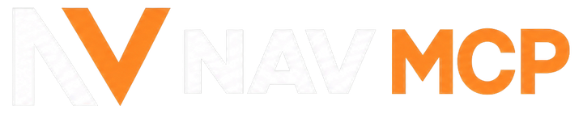
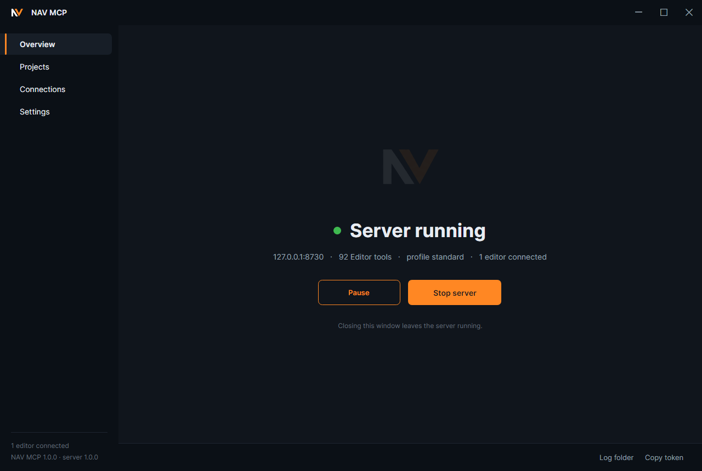
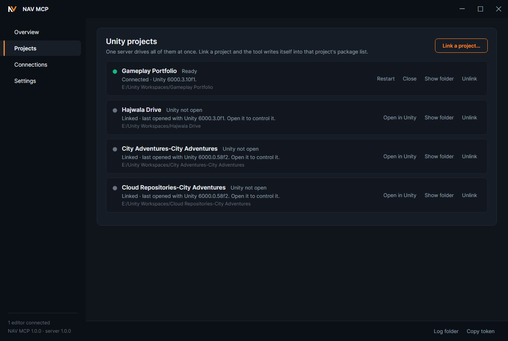
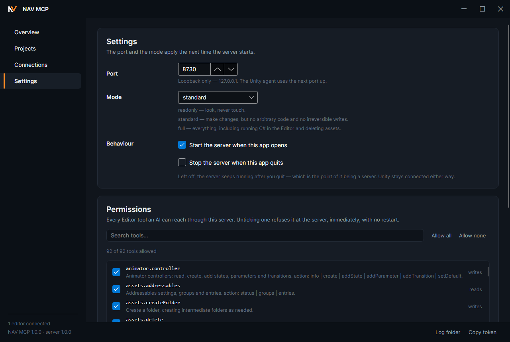

<div align="center">



**Control Unity Editor from Claude, Cursor, or any other MCP client**

NAV MCP connects an MCP client to one or more Unity projects. It can inspect scenes, create and
edit objects, manage assets, run diagnostics, and automate common Editor work.

<a href="https://github.com/Biltoa/nav-mcp-unity/releases/latest"></a>
<a href="https://github.com/Biltoa/nav-mcp-unity/releases/latest"></a>

<br>


[](LICENSE)
[](https://github.com/Biltoa/nav-mcp-unity/actions/workflows/ci.yml)

[What it does](#what-nav-mcp-does) · [Install](#install) · [How it works](#how-it-works) · [Tools](#the-six-mcp-tools) · [Permissions](#permissions-and-safety) · [Performance](#performance) · [Build](#build-it-yourself)

</div>

---

## What NAV MCP does

MCP, or Model Context Protocol, is a standard that lets applications such as Claude Desktop,
Claude Code, and Cursor call external tools. NAV MCP provides those tools for Unity Editor.

Once a Unity project is linked, your MCP client can:

- inspect open scenes, GameObjects, components, transforms, and assets;
- create and edit GameObjects, prefabs, materials, animation, UI, lighting, and effects;
- query physics and navigation data without entering Play mode;
- inspect audio, terrain, Timeline, Cinemachine, build settings, and console output;
- batch many changes into one Editor update and one undo step;
- run C# inside the Editor when a task does not fit a regular tool;
- manage several Unity projects through one server.

NAV MCP currently includes 99 Unity Editor operations across 22 areas. The complete generated
catalog is in [docs/TOOLS.md](docs/TOOLS.md).



## Install

Download the [latest release](https://github.com/Biltoa/nav-mcp-unity/releases/latest). The app is
self-contained. You do not need to install .NET, Node.js, or Python.

### Windows

Run the installer. It installs for your Windows account and does not require administrator access.
The build is not code-signed, so Windows SmartScreen may appear the first time. Select
**More info**, then **Run anyway**.

### macOS

Open the `.dmg` and drag **NAV MCP** into Applications. The build is not code-signed, so on the
first launch, right-click the app and choose **Open**.

### Connect a Unity project

1. Open NAV MCP. The server starts automatically.
2. Select **Projects**, then **Link a project...**, and choose the Unity project folder.
3. Select **Connections**, then connect the MCP client you use.
4. Restart that client so it loads the new MCP configuration.
5. Ask the client to run `unity_projects`.

`unity_projects` should show the linked project, its health, and whether Unity Editor is connected.
If Unity is compiling, NAV MCP reports that state instead of making the project disappear.

<details>
<summary><b>Run the server without the desktop app</b></summary>

Start the daemon:

```bash
umcpd --profile standard
```

Then configure the MCP client to launch the stdio shim. The shim starts the daemon when needed and
reads the local access token automatically.

```jsonc
{
  "mcpServers": {
    "unity": {
      "command": "C:/path/to/umcp-stdio.exe",
      "args": ["--port", "8730"]
    }
  }
}
```

See [docs/INSTALL.md](docs/INSTALL.md) for the full setup guide and the manual
`Packages/manifest.json` installation method.

</details>

## How it works

Most MCP servers publish every operation as a separate MCP tool. The client receives every tool
name, description, and argument schema before the conversation begins, even when most of those
tools are never used.

NAV MCP takes a different approach. Your client initially sees six small gateway tools. It asks for
detailed Unity guidance and schemas only when a task needs them. Behind those six gateways are all
99 Editor operations.

This matters because a language model has a limited context window. A token is a small unit of text
stored in that context. Tool descriptions use the same context space as your request, source code,
and the model's answer. A smaller starting catalog leaves more room for the work you actually want
done.

In the current measured build, NAV MCP's six gateway definitions use about 930 tokens. A reference
Unity MCP server used during development exposed 356 tools at once and used about 56,800 tokens
before a task began. The comparison shows the cost of a large flat catalog. It is not a claim that
every other MCP server has the same size.

## The six MCP tools

| Tool | What it does |
|---|---|
| `unity_run` | Runs one Unity Editor operation by its id |
| `unity_batch` | Runs several operations together in one Editor update and one undo step |
| `unity_script` | Compiles and runs C# inside Unity Editor |
| `unity_find` | Searches for the right Unity operation or guidance |
| `unity_skill` | Loads guidance and argument schemas for one area, such as physics or animation |
| `unity_projects` | Lists linked projects and manages Editor connections |

For example, a client can load the animation guidance, then call the existing
`animator.controller` operation with an action:

```js
animator.controller({
  action: "addTransition",
  path,
  from: "Idle",
  to: "Run",
  parameter: "Speed",
  greaterThan: 0.1
})
```

Related actions share one operation instead of adding a separate MCP tool for every small variation.
This keeps the catalog easier to search and cheaper to load.

## One server for every project



You can link several Unity projects to one NAV MCP server. Each project has its own stable id, and
the daemon keeps a separate connection to every open Editor. Requests are routed by project id, not
by whichever Editor happened to connect most recently.

The daemon runs outside Unity's script AppDomain. When Unity recompiles scripts and reloads that
AppDomain, NAV MCP keeps the request queue, tool catalog, and scene model alive. Work pauses during
the reload and continues afterward.

Read requests can keep working while Unity compiles. The server also exposes the compile state
quickly, even when the Unity window is not focused. If a modal dialog blocks the Editor, NAV MCP
reports the project as blocked and identifies the dialog instead of waiting for an unexplained
timeout.

## Permissions and safety



NAV MCP has three permission modes:

| Mode | What it allows |
|---|---|
| `readonly` | Read operations only |
| `standard` (default) | Normal Editor changes, but no arbitrary code or irreversible operations |
| `full` | Every operation, including C# execution and asset deletion |

You can also disable individual operations. For example, disabling `assets.delete` makes the server
return `E_TOOL_DISABLED` whenever a client tries to use it. The setting takes effect immediately.

Mutating batches create one named Unity undo step. The NAV MCP app also provides an undo button.
Operations that Unity cannot undo are identified in their tool metadata.

Both network listeners bind only to `127.0.0.1`. Every request except `/health` also requires a
bearer token generated at startup and stored so only your account can read it.

## Performance

These measurements come from the included benchmark harness running against a licensed Unity
Editor. The harness records whether the Unity window is focused because window focus can change
Editor round-trip timing significantly.

| Measurement | Result | What it means |
|---|---|---|
| MCP catalog loaded at startup | About **930 tokens** | Only the six gateway tools occupy the model's context before work starts |
| Cached scene query | About **1 ms** | Common hierarchy reads come from the daemon's live scene model |
| 32 Editor operations | About **one Editor update** | A batch crosses the Unity connection once and creates one undo step |
| Code mode response for 20 operations | **145 bytes**, compared with 6,020 bytes for individual operation results | C# can return a compact conclusion instead of every intermediate result |
| WebGL validation | **8 errors and 25 warnings in 307 ms** in the benchmark project | Detectable platform problems can be reported before starting a long build |

The 930-token number is not the cost of using NAV MCP for an entire task. It is only the initial
space used by the six MCP tool definitions. When the client loads guidance for animation, physics,
or another area, that additional information also uses context.

## Architecture

```text
MCP client -> umcp-stdio -> umcpd -> UnityAgent
                 shim       daemon    one connection per Editor
                              ^
                              |
                         NAV MCP app
```

| Component | Purpose |
|---|---|
| `umcpd` | The .NET 8 daemon that hosts MCP, routes projects, tracks health, and supports C# code mode |
| **NAV MCP** | The Avalonia desktop app for starting the server, linking projects, and managing permissions |
| `umcp-stdio` | The small process launched by an MCP client to reach the daemon |
| `com.umcp.agent` | The Unity package that runs operations on the main thread and streams scene changes |

## Build it yourself

Requirements:

- .NET 8 SDK
- Unity 6000.0 or newer for live Editor testing

Build and test:

```bash
dotnet build UnityMcpTool.sln
dotnet test UnityMcpTool.sln
dotnet run --project src/Umcp.Gui
```

There are currently 159 tests that run without a Unity licence. Live Editor benchmarks and the
full catalog smoke test use `src/Umcp.Bench`.

Create Windows packages:

```powershell
pwsh scripts/publish.ps1
```

Create macOS packages:

```bash
scripts/publish.sh --arch both
```

Publishing checks that generated files match their sources, all tests pass, and the Unity package
passes the main-thread safety check. See [CONTRIBUTING.md](CONTRIBUTING.md) for development rules.

## Project status

Current release: **1.0.0**

The Windows build is exercised regularly against real Unity projects. CI builds and render-checks
the macOS app on every push, but it has not yet been manually tested on a physical Mac.

Neither platform build is code-signed, so each operating system shows a one-time security warning.

## Licence

[MIT](LICENSE)
